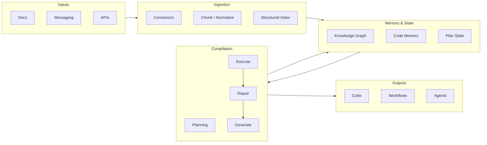

# Architecture

This document describes the high-level architecture of the Agentic Knowledge Compiler: data flow, components, and their roles.

## Overview

AKC turns messy inputs (docs, messaging, APIs) into executable artifacts (code, workflows, agent specs) through a pipeline: **Ingestion → Memory → Compilation → Outputs**. The compile phase is a loop: Plan → Retrieve → Generate → Execute → Repair, with retrieval from both the structured index and code memory to keep outputs grounded and correct.

## Flow diagram

## Component roles

### 1. Inputs

- **Docs:** Markdown, HTML, and other document formats; living docs and specs.
- **Messaging:** Slack, Discord, Teams, Matrix, etc., structured as Q&A or threads (with auth and filters).
- **APIs:** OpenAPI specs and similar; optional schema extraction for API-derived workflows.

### 2. Ingestion (`src/akc/ingest/`)

- **Connectors:** Plugins per source type (docs, API, messaging). Each connector fetches and normalizes into a common shape.
- **Chunk / Normalize:** Chunking for retrieval with overlap; connectors and chunking must preserve **tenant isolation** via `tenant_id` in metadata.
- **Embedding:** Optional step that converts chunks into vectors for similarity search (remote providers or local/deterministic embeddings for tests).
- **Structured Index:** Vector store (and optional graph) for retrieval during compilation. All search APIs are tenant-scoped to prevent cross-tenant retrieval. Enables “retrieve before generate” (ARCS/DeepCode-style).
- **Ingestion state (incremental):** Optional per-tenant state to support incremental re-ingestion (e.g. file mtimes, Slack cursors, OpenAPI ETag) without re-indexing everything.

### 3. Memory & State (`src/akc/memory/`)

- **Knowledge Graph (optional):** Entities and relations for “why” and conflict detection (ActMem-style).
- **Code Memory:** Persistent store of generated or existing code artifacts (DeepCode-style); used by the compile loop to avoid hallucination and stay consistent.
- **Plan State:** Current goal, steps done, next step (ReAct/agent-style state).

### 4. Compilation (`src/akc/compile/`)

- **Plan:** Break high-level goals into steps.
- **Retrieve:** Query the structured index and code memory before each generation step.
- **Generate:** Produce code or other artifacts (e.g. via LLM or local models).
- **Execute:** Run generated code in a sandbox.
- **Repair:** On failure, use tests and feedback to drive repair (synthesize–execute–repair loop, ARCS-style). Optional tiered controller for latency/quality tradeoff.

#### 4.1 Compile loop capabilities

- **Tiered controller:** ARCS-style small → medium → large tiers for `generate` and `repair`, with conservative escalation on failures and explicit tier history in accounting.
- **Tests by default:** Every candidate runs tests via a configurable `ControllerConfig`, supporting `full`-only or `smoke`+`full` modes with periodic full runs and promotion gates that require a passing full stage.
- **Policy gates:** Enforces “tests generated by default” (non-test changes must be accompanied by tests) and an optional verifier gate that can veto unsafe or cross-tenant patches even when tests pass.
- **Tenant + repo isolation:** All LLM and executor calls are scoped by `(tenant_id, repo_id)`; patches are treated as artifacts and the executor is responsible for tenant-safe application and sandboxing.
- **Code memory integration:** Successful patches and their test outputs are persisted into code memory as items keyed by plan and step, enabling retrieval, drift detection, and future compilation runs.

#### 4.2 Compile loop assumptions

- **Unified diff outputs:** LLM backends are expected to return unified diff patches (no prose or Markdown fences) so the controller can deterministically extract touched paths and test files.
- **Conventional test layout:** Test discovery assumes Python-style layouts (`tests/`, `test_*.py`, `*_test.py`) when enforcing test policies.
- **Executor sandboxing:** The executor layer is responsible for process isolation, filesystem sandboxing, resource limits, and enforcing tenant boundaries at runtime.
- **Budget configuration:** Callers must provide a `ControllerConfig` with appropriate budgets (LLM calls, repairs, wall-clock limits); the controller treats these as hard constraints.

### 5. Outputs (`src/akc/outputs/`)

- **Code:** Generated or updated source files.
- **Workflows:** YAML/DSL workflow definitions.
- **Agents:** Agent specs and configurations as first-class artifacts.

Output emitters are extension points so new artifact types can be added without changing the core loop.

## Rust Optional Components

AKC can optionally delegate two security/performance-sensitive responsibilities to Rust, while keeping the core orchestration and compilation loop in Python:

- `akc_executor`: a sandboxed execution service used by the Execute phase.
- `akc_ingest`: a high-throughput ingestion/normalization CLI used by the ingest pipeline (currently supports the `docs` ingest kind; `messaging`/`api` kinds are protocol-defined but not yet implemented in Rust).

Invocation surfaces (same request/response schema):
- Subprocess JSON CLI boundary (auditability and reproducibility).
- PyO3 module embedding (low overhead when running inside the Python process).

Security model alignment:
- Every request includes `tenant_id` and `run_id`.
- Execution is defense-in-depth with two sandbox lanes:
  - WASM (Wasmtime + WASI Preview 1) with capability-based host interfaces.
  - OS process sandbox with per-run working directories, env scrubbing, and resource limits.
- Logs and outputs include tenant/run correlation ids and avoid cross-tenant leakage.

See [docs/security.md](security.md) for the threat model and tenant isolation guarantees.

## Design principles

- **Extension points:** New connectors and output types plug in via clear interfaces; core stays stable. Connectors and vector stores are pluggable via CLI flags (e.g. `--connector`, `--index-backend`) and ingest modules; new backends can be added without changing the core loop.
- **Correctness-aware:** Tests by default in the compile loop; optional formal verification for critical paths.
- **Transparent:** No mandatory proprietary models or APIs; support local/open models and optional cloud backends. Default CLI flows do not require API keys: embedding defaults to offline (`none` or `hash`), and the compile command uses an offline LLM backend by default; OpenAI/Gemini and other cloud-backed options are opt-in only.
- **Reproducible:** One-command install and a short sequence for a full run (e.g. `uv sync && uv run akc compile --tenant-id my-tenant --repo-id my-repo --outputs-root ./out` after ingest; see [Getting started](getting-started.md#end-to-end-run-ingest--compile--verify)).

#### End-to-end run

A minimal reproducible path is: **ingest** (optional index) → **compile** → **verify**. All artifacts are written under `<outputs-root>/<tenant-id>/<repo-id>/`: `manifest.json`, `.akc/tests/`, code memory (`.akc/memory.sqlite`), and living/drift baselines. The [getting started](getting-started.md#end-to-end-run-ingest--compile--verify) guide shows the exact CLI commands and a fully offline flow (no API keys).

For research grounding (DeepCode, ARCS, DocAgent, ReAct, ActMem), see [research.md](research.md).
