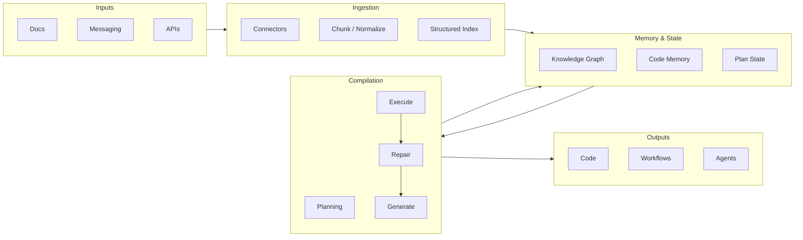

# Architecture

This document describes the high-level architecture of the Agentic Knowledge Compiler: data flow, components, and their roles.

## Overview

AKC turns messy inputs (docs, messaging, APIs) into executable artifacts (code, workflows, agent specs) through a pipeline: **Ingestion → Memory → Compilation → Outputs**. The compile phase is a loop: Plan → Retrieve → Generate → Execute → Repair, with retrieval from both the structured index and code memory to keep outputs grounded and correct.

## Flow diagram

## Component roles

### 1. Inputs

- **Docs:** Markdown, HTML, and other document formats; living docs and specs.
- **Messaging:** Slack, Discord, Teams, Matrix, etc., structured as Q&A or threads (with auth and filters).
- **APIs:** OpenAPI specs and similar; optional schema extraction for API-derived workflows.

### 2. Ingestion (`src/akc/ingest/`)

- **Connectors:** Plugins per source type (docs, API, messaging). Each connector fetches and normalizes into a common shape.
- **Chunk / Normalize:** Chunking for retrieval with overlap; connectors and chunking must preserve **tenant isolation** via `tenant_id` in metadata.
- **Embedding:** Optional step that converts chunks into vectors for similarity search (remote providers or local/deterministic embeddings for tests).
- **Structured Index:** Vector store (and optional graph) for retrieval during compilation. All search APIs are tenant-scoped to prevent cross-tenant retrieval. Enables “retrieve before generate” (ARCS/DeepCode-style).
- **Ingestion state (incremental):** Optional per-tenant state to support incremental re-ingestion (e.g. file mtimes, Slack cursors, OpenAPI ETag) without re-indexing everything.

### 3. Memory & State (`src/akc/memory/`)

- **Knowledge Graph (optional):** Entities and relations for “why” and conflict detection (ActMem-style).
- **Code Memory:** Persistent store of generated or existing code artifacts (DeepCode-style); used by the compile loop to avoid hallucination and stay consistent.
- **Plan State:** Current goal, steps done, next step (ReAct/agent-style state).

### 4. Compilation (`src/akc/compile/`)

- **Plan:** Break high-level goals into steps.
- **Retrieve:** Query the structured index and code memory before each generation step.
- **Generate:** Produce code or other artifacts (e.g. via LLM or local models).
- **Execute:** Run generated code in a sandbox.
- **Repair:** On failure, use tests and feedback to drive repair (synthesize–execute–repair loop, ARCS-style). Optional tiered controller for latency/quality tradeoff.

### 5. Outputs (`src/akc/outputs/`)

- **Code:** Generated or updated source files.
- **Workflows:** YAML/DSL workflow definitions.
- **Agents:** Agent specs and configurations as first-class artifacts.

Output emitters are extension points so new artifact types can be added without changing the core loop.

## Design principles

- **Extension points:** New connectors and output types plug in via clear interfaces; core stays stable.
- **Correctness-aware:** Tests by default in the compile loop; optional formal verification for critical paths.
- **Transparent:** No mandatory proprietary models or APIs; support local/open models and optional cloud backends.
- **Reproducible:** One-command install and run (e.g. `uv sync && uv run akc compile --input ./docs` when the loop is implemented).

For research grounding (DeepCode, ARCS, DocAgent, ReAct, ActMem), see [research.md](research.md).
