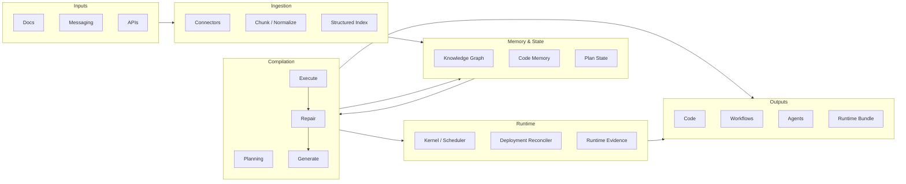

# Architecture

This document describes the high-level architecture of the Agentic Knowledge Compiler: data flow, components, and their roles.

## Overview

AKC turns messy inputs (docs, messaging, APIs) into executable artifacts and runtime bundles through a pipeline: **Ingestion → Memory → Compilation → Runtime → Evidence/Outputs**. The compile phase is a loop: Plan → Retrieve → Generate → Execute → Repair, with retrieval from both the structured index and code memory to keep outputs grounded and correct.

Phase A hardening introduces two compiler contracts:
- **Versioned IR (`src/akc/ir/`)**: a typed, stable intermediate representation (nodes, dependencies, effect annotations, provenance pointers) that becomes the pass boundary between ingestion and compilation.
- **Run manifest (`src/akc/run/`)**: a replay/audit artifact with IR fingerprint, retrieval snapshots, per-pass records, and replay mode.

## Flow diagram

## Component roles

### 1. Inputs

- **Docs:** Markdown, HTML, and other document formats; living docs and specs.
- **Messaging:** Slack, Discord, Teams, Matrix, etc., structured as Q&A or threads (with auth and filters).
- **APIs:** OpenAPI specs and similar; optional schema extraction for API-derived workflows.

### 2. Ingestion (`src/akc/ingest/`)

- **Connectors:** Plugins per source type (docs, API, messaging). Each connector fetches and normalizes into a common shape.
- **Scope:** The maintained Python connectors are **docs**, **OpenAPI**, and **Slack** (under `src/akc/ingest/connectors/`). Alignment and “executable knowledge” proof do not require additional connector types as long as those three suffice for representative chunk shapes; add a new connector when a product need requires **new normalization or chunk semantics** the existing three cannot cover. Follow `.cursor/skills/akc-add-connector/SKILL.md` and add at least **one fixture and one integration test** per new connector so CI keeps coverage explicit.
- **Chunk / Normalize:** Chunking for retrieval with overlap; connectors and chunking must preserve **tenant isolation** via `tenant_id` in metadata.
- **Embedding:** Optional step that converts chunks into vectors for similarity search (remote providers or local/deterministic embeddings for tests).
- **Structured Index:** Vector store (and optional graph) for retrieval during compilation. All search APIs are tenant-scoped to prevent cross-tenant retrieval. Enables “retrieve before generate” (ARCS/DeepCode-style).
- **Ingestion state (incremental):** Optional per-tenant state to support incremental re-ingestion (e.g. file mtimes, Slack cursors, OpenAPI ETag) without re-indexing everything.

### 3. Memory & State (`src/akc/memory/`)

- **Knowledge Graph (optional):** Entities and relations for “why” and conflict detection (ActMem-style).
- **Code Memory:** Persistent store of generated or existing code artifacts (DeepCode-style); used by the compile loop to avoid hallucination and stay consistent.
- **Plan State:** Current goal, steps done, next step (ReAct/agent-style state).

### 4. Compilation (`src/akc/compile/`)

- **Plan:** Break high-level goals into steps.
- **Retrieve:** Query the structured index and code memory before each generation step.
- **Generate:** Produce code or other artifacts (e.g. via LLM or local models).
- **Execute:** Run generated code in a sandbox.
- **Repair:** On failure, use tests and feedback to drive repair (synthesize–execute–repair loop, ARCS-style). Optional tiered controller for latency/quality tradeoff.

#### 4.1 Compile loop capabilities

- **Tiered controller:** ARCS-style small → medium → large tiers for `generate` and `repair`, with conservative escalation on failures and explicit tier history in accounting.
- **Tests by default:** Every candidate runs tests via a configurable `ControllerConfig`, supporting `full`-only or `smoke`+`full` modes with periodic full runs and promotion gates that require a passing full stage.
- **Policy gates:** Enforces “tests generated by default” (non-test changes must be accompanied by tests) and an optional verifier gate that can veto unsafe or cross-tenant patches even when tests pass.
- **Tenant + repo isolation:** All LLM and executor calls are scoped by `(tenant_id, repo_id)`; patches are treated as artifacts and the executor is responsible for tenant-safe application and sandboxing.
- **Code memory integration:** Successful patches and their test outputs are persisted into code memory as items keyed by plan and step, enabling retrieval, drift detection, and future compilation runs.
- **Developer-role profile defaults (opt-in):** `--developer-role-profile emerging` (or `emerging` via `AKC_DEVELOPER_ROLE_PROFILE` / `.akc/project.json`, e.g. after **`akc init`**) adds deterministic defaults and emits profile decision sidecars so operators can debug resolved policy/runtime choices without manual setup seeding. The implicit default when none of those are set is **`classic`**.

#### 4.2 Compile loop assumptions

- **Unified diff outputs:** LLM backends are expected to return unified diff patches (no prose or Markdown fences) so the controller can deterministically extract touched paths and test files.
- **Conventional test layout:** Test discovery assumes Python-style layouts (`tests/`, `test_*.py`, `*_test.py`) when enforcing test policies.
- **Executor sandboxing:** The executor layer is responsible for process isolation, filesystem sandboxing, resource limits, and enforcing tenant boundaries at runtime. Phase C introduces a Python-side secure sandbox abstraction (`src/akc/execute/`) and passes an optional `run_id` to the sandbox (`ExecutionRequest.run_id`) so sandboxes can namespace per-run state (e.g. HOME/XDG dirs) without cross-run contamination.
- **Budget configuration:** Callers must provide a `ControllerConfig` with appropriate budgets (LLM calls, repairs, wall-clock limits); the controller treats these as hard constraints.

#### 4.3 Compiler spine contracts (IR + run manifest)

- **IR schema + versioning:** `IRDocument` and `IRNode` define a deterministic JSON shape (`schema_kind`, `schema_version`, `format_version`) with stable node IDs, sorted serialization, and tenant-scoped provenance pointers.
- **IR schema reference:** [docs/ir-schema.md](/Users/dami/Documents/Runform/docs/ir-schema.md) is the durable reference for node kinds, `OperationalContract`, and validation invariants.
- **IR diffing:** `diff_ir` produces audit-friendly `added`/`removed`/`changed` node IDs for safe review and targeted recompilation.
- **Run manifest format:** `RunManifest` captures run scope (`tenant_id`, `repo_id`), `ir_sha256`, retrieval snapshots, pass records, and model parameters; `stable_hash()` gives deterministic fingerprints for CI/eval anchoring.
- **Replay modes:** `live`, `llm_vcr`, `full_replay`, and `partial_replay` are represented explicitly and resolved to model/tool call policy in `decide_replay_for_pass`.
- **Tenant isolation:** IR nodes and provenance are validated against a single `tenant_id`; manifests are always tenant+repo scoped, preventing cross-tenant replay artifacts.

#### 4.4 Observability and provenance artifacts (control-plane contract)

Compile emits control-plane-friendly artifacts under:
`<outputs-root>/<tenant-id>/<repo-id>/`

Run-level artifacts:
- `.akc/run/<run_id>.manifest.json`
- `.akc/run/<run_id>.spans.json`
- `.akc/run/<run_id>.costs.json`
- `.akc/run/<run_id>.log.txt`

IR and policy artifacts:
- `.akc/ir/<run_id>.json`
- `.akc/ir/<run_id>.diff.json` (when a prior IR exists)
- `.akc/policy/<run_id>_<step_id>.decisions.json` (when policy decisions exist)

Execution/test artifacts:
- `.akc/tests/<run_id>_<step_id>.smoke.json`
- `.akc/tests/<run_id>_<step_id>.full.json`
- `.akc/tests/<run_id>_<step_id>.stdout.txt`
- `.akc/tests/<run_id>_<step_id>.stderr.txt`

Trace span contract (OpenTelemetry-compatible shape):
- **Hierarchy:** `compile.run` -> `compile.step` -> `compile.retrieve` / `compile.llm.complete` / `compile.executor.*` / `compile.verify`
- **Fields:** `trace_id`, `span_id`, `parent_span_id`, `name`, `kind`,
  `start_time_unix_nano`, `end_time_unix_nano`, `attributes`, `status`
- **Compatibility note:** Span JSON is stored as plain objects so control planes can ingest directly into OTel pipelines or transform to OTLP.

Cost attribution contract:
- **Scope fields:** `tenant_id`, `repo_id`, `run_id`
- **Usage fields:** `llm_calls`, `tool_calls`, `input_tokens`, `output_tokens`, `total_tokens`
- **Loop fields:** `repair_iterations`, `wall_time_ms`
- **Budget echo:** `budget` from `ControllerConfig` for per-run budget auditability

Tenant-isolation impact:
- All artifact paths are scoped by tenant+repo.
- Trace and cost records include tenant+repo identifiers.
- Policy decisions and run manifests are never shared across scopes, so control-plane attribution remains tenant-safe by construction.

#### 4.5 Compile realization (intent → working tree)

By default, compile uses **`scoped_apply`**: a **scoped working-tree apply** of the strict unified-diff patch after preflight, subject to policy. **`artifact_only`** is opt-in: compile stops at **validated artifacts** with no working-tree writes. This is the AKC boundary for “intent → system” without bypassing safety gates.

| Mode (`--compile-realization-mode`) | Behavior | Typical use |
|-------------------------------------|----------|-------------|
| `scoped_apply` (default) | After preflight (path allowlist, scope-root confinement, strict patch parse), apply the patch under `--apply-scope-root` or resolved `--work-root` / outputs scope; requires policy allow for `compile.patch.apply`. | Intent→filesystem flow; controlled realization when policy and promotion/runtime gates allow. |
| `artifact_only` (opt-in) | No working-tree writes from compile; patches and test results are artifacts under the outputs tree. | CI, audits, replay-first workflows, or environments where surprise writes are unacceptable. |

**Risk profile guidance**

- **Low risk / no tree writes:** `artifact_only` + `--policy-mode enforce` + offline or audited backends. No surprise filesystem mutation; operators review artifacts and apply changes out-of-band or in a separate step.
- **Medium risk:** `scoped_apply` (default) in a **dedicated** clone or worktree, narrow scope root, `staged_apply` or `artifact_only` promotion until signed packets and runtime gates are proven; always enforce Rego policy and treat denials as first-class outcomes.
- **Higher risk (requires full gate stack):** `scoped_apply` with `live_apply` / runtime reconcile paths — only after promotion packets, compile-apply attestation, and runtime live-mutation policy are configured; use autopilot scoreboards and rollback evidence as described in `docs/runtime-execution.md`.

**Invariants:** Default is fail-closed (`scoped_apply` still requires policy allow and successful preflight; denial leaves artifacts-only behavior). **`artifact_only`** is available for conservative runs. Scoped apply never bypasses tenant/repo isolation, strict patch format, or default-deny policy for mutating actions.

### 5. Outputs (`src/akc/outputs/`)

- **Code:** Generated or updated source files.
- **Workflows:** YAML/DSL workflow definitions.
- **Agents:** Agent specs and configurations as first-class artifacts.

Output emitters are extension points so new artifact types can be added without changing the core loop.

### 6. Runtime layer (`src/akc/runtime/`)

The runtime layer consumes the compile-time `runtime_bundle` artifact and executes runtime-scoped workflows, services, and reconciliation loops without collapsing the existing compile contracts.

- **Compile handoff:** `src/akc/compile/artifact_passes.py` emits `.akc/runtime/<run_id>.runtime_bundle.json`, and `src/akc/compile/session.py` records that pass in the run manifest for deterministic replay and operator inspection.
- **Kernel + scheduler:** `src/akc/runtime/kernel.py`, `src/akc/runtime/scheduler.py`, and `src/akc/runtime/state_store.py` build a runtime graph from IR contracts, persist checkpoints/queue snapshots, enforce idempotent ordering, and recover safely after restart.
- **Adapters + native fallback:** `src/akc/runtime/adapters/` defines the adapter protocol and registry; unsupported capabilities fall back explicitly to the native backend instead of silently degrading behavior.
- **Local execution depth:** optional subprocess routing, registry defaults, and checkpoint/replay semantics are described in [runtime-execution.md](runtime-execution.md).
- **Deployment reconciler:** `src/akc/runtime/reconciler.py` computes desired vs observed state, supports `simulate|enforce|canary`, and records compensation/rollback evidence when convergence fails.
- **Policy and scope threading:** every runtime API threads `tenant_id`, `repo_id`, `run_id`, and `runtime_run_id`, and runtime state is stored under tenant/repo scoped `.akc/runtime/` roots only.

### 6.1 Runtime control-plane and replay contract

Runtime execution extends the control-plane surface beyond compile-only evidence:

- **Operator CLI:** `akc runtime start|stop|status|events|reconcile|checkpoint|replay`
- **Runtime record:** `.akc/runtime/<run_id>/<runtime_run_id>/runtime_run.json`
- **Evidence transcript:** `.akc/runtime/<run_id>/<runtime_run_id>/runtime_evidence.json`
- **Replay modes:** `runtime_replay` reconstructs transition/action history; `reconcile_replay` reconstructs reconcile/rollback decisions from recorded evidence
- **Living integration:** runtime degradation and reconcile failures can feed `src/akc/living/safe_recompile.py` as recompile triggers, gated by runtime policy and canary thresholds

### 6.2 Debugging checklist (manifest → policy → control)

When something fails in an **`emerging`** or policy-heavy flow, walk artifacts and commands in this order. Every step stays **tenant+repo scoped**; do not mix manifests or bundles across tenants.

1. **Run manifest** — `.akc/run/<run_id>.manifest.json` under `<outputs-root>/<tenant-id>/<repo-id>/`. Confirms `tenant_id`, `repo_id`, `run_id`, IR fingerprint, and pass records. If replay looks wrong, the manifest is the source of truth for what was recorded.
2. **`developer_profile_decisions`** — sidecar JSON (path referenced from the manifest’s **`control_plane.developer_profile_decisions_ref`**). Shows how the developer-role profile resolved ingest/compile/runtime defaults versus CLI/env/project file.
3. **Intent store (authority)** — canonical intent JSON for operational coupling lives under **`<outputs-root>/.akc/intent/<tenant-id>/<repo-id>/<intent_id>.json`**, matching the compile session’s `JsonFileIntentStore` layout (not under `<outputs-root>/<tenant>/<repo>/.akc/intent/…` alone).
4. **Policy bundle and decisions** — Rego/OPA inputs and emitted **`.akc/policy/<run_id>_<step_id>.decisions.json`** when policy ran. Use these to see **allow/deny** with tenant/repo/action context before blaming tests or the verifier.
5. **Replay plan** — `akc control replay plan --manifest …` or `--outputs-root` + `--tenant-id` + `--repo-id` + `--run-id`. Produces a schema-valid **`akc_replay_plan`** with suggested partial-replay passes and argv hints; treat as runbook/CI documentation, not blind execution.
6. **`akc control`** — `akc control runs show`, manifest diff, playbooks, and related commands tie **`run_id`** to operator forensics. Use the same **`outputs-root` / tenant / repo** as the failing run.

Optional cross-checks: **`akc verify`** emits **`.akc/verification/verify_developer_context.v1.json`** (resolved profile + manifest path). Runtime evidence lives under **`.akc/runtime/`** as described in [getting-started.md](getting-started.md#runtime-operations).

## Rust Optional Components

AKC can optionally delegate two security/performance-sensitive responsibilities to Rust, while keeping the core orchestration and compilation loop in Python:

- `akc_executor`: a sandboxed execution service used by the Execute phase.
- `akc_ingest`: a high-throughput ingestion/normalization CLI used by the ingest pipeline (currently supports the `docs` ingest kind; `messaging`/`api` kinds are protocol-defined but not yet implemented in Rust).

Invocation surfaces (same request/response schema):
- Subprocess JSON CLI boundary (auditability and reproducibility).
- PyO3 module embedding (low overhead when running inside the Python process).

Security model alignment:
- Every request includes `tenant_id` and `run_id`.
- Execution is defense-in-depth with two sandbox lanes:
  - WASM (Wasmtime + WASI Preview 1) with capability-based host interfaces.
  - OS process sandbox with per-run working directories, env scrubbing, and resource limits.
- Compile adds a WASM preflight before execution:
  - verifies the Rust/Wasmtime execution surface is available when WASM is requested
  - rejects unsupported strict/enforced platform combinations before the controller starts running tests
- Platform capability note:
  - Linux and macOS currently support strict compile-time WASM guarantees
  - Windows currently does not support WASM wall-time enforcement, so strict/enforced compile runs fail closed instead of degrading
- Logs and outputs include tenant/run correlation ids and avoid cross-tenant leakage.

See [docs/security.md](security.md) for the threat model and tenant isolation guarantees.

## Design principles

- **Extension points:** New connectors and output types plug in via clear interfaces; core stays stable. Connectors and vector stores are pluggable via CLI flags (e.g. `--connector`, `--index-backend`) and ingest modules; new backends can be added without changing the core loop.
- **Correctness-aware:** Tests by default in the compile loop; optional formal verification for critical paths.
- **Transparent:** No mandatory proprietary models or APIs; support local/open models and optional cloud backends. Default CLI flows do not require API keys: embedding defaults to offline (`none` or `hash`), and the compile command uses an offline LLM backend by default; OpenAI/Gemini and other cloud-backed options are opt-in only.
- **Reproducible:** One-command install and a short sequence for a full run (e.g. `uv sync && uv run akc compile --tenant-id my-tenant --repo-id my-repo --outputs-root ./out` after ingest; see [Getting started](getting-started.md#end-to-end-run-ingest--compile--verify)).

#### End-to-end run

A minimal reproducible path is: **ingest** (optional index) → **compile** → **verify**. All artifacts are written under `<outputs-root>/<tenant-id>/<repo-id>/`: `manifest.json`, `.akc/tests/`, code memory (`.akc/memory.sqlite`), and living/drift baselines. The [getting started](getting-started.md#end-to-end-run-ingest--compile--verify) guide shows the exact CLI commands and a fully offline flow (no API keys).

For research grounding (DeepCode, ARCS, DocAgent, ReAct, ActMem), see [research.md](research.md).
