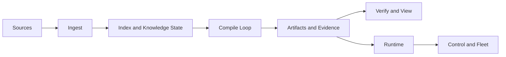

# Architecture

This document describes the current high-level architecture of AKC as implemented in this repository.

## Overview

AKC converts repository and external knowledge into structured artifacts that can be compiled, verified, replayed, and inspected locally.

The system is organized around five major areas:

1. ingestion
2. memory and knowledge state
3. compile and verification
4. runtime and living workflows
5. control-plane and viewer surfaces

The compile loop is:

**Plan -> Retrieve -> Generate -> Execute -> Repair**

## Current package map

The main Python package lives under `src/akc/`.

| Package | Role |
| --- | --- |
| `ingest/` | Connectors, chunking, embeddings, and vector index backends |
| `memory/` | Plan state, code memory, salience ranking, why/conflict stores |
| `intent/` | Intent models, resolution, operational evaluation inputs |
| `ir/` | Versioned intermediate representation and diffing |
| `compile/` | Controller, retrieval, verification, artifact passes, scoped apply, compile-time MCP and skill hooks |
| `run/` | Run manifests, replay helpers, delivery lifecycle projections, time-compression metrics |
| `outputs/` | Manifest emitters, workflow/system-spec helpers, drift and fingerprint helpers |
| `runtime/` | Runtime kernel, adapters, action routing, reconcile, autopilot, coordination, state stores |
| `control/` | Policy bundles, forensics/export flows, metrics, fleet aggregation, operations indexes |
| `control_bot/` | Standalone multi-channel operator gateway |
| `delivery/` | Named-recipient delivery sessions, packaging/distribution abstractions, provider clients |
| `viewer/` | Read-only TUI, web bundle, and export surfaces |
| `living/` | Drift-triggered safe recompile, runtime bridge, automation profiles |
| `coordination/` | Shared coordination graph models and scheduling semantics |
| `knowledge/` | Knowledge snapshots, persistence, fingerprints, operator decisions |
| `artifacts/` | Artifact envelopes, schemas, and validation helpers |
| `validation.py` | Operator-side validator registry loading, execution, and normalized validator evidence export |
| `execute/` | Sandbox/executor factory and strong/dev execution surfaces |
| `evals/` | Evaluation harness |
| `mcp_serve/` | Read-only MCP server surface for indexed knowledge and run metadata |
| `action/` | Optional action-plane intent and execution surfaces |
| `adopt/` | Project/toolchain detection and progressive-adoption helpers |

Optional Rust crates live under `rust/crates/`:

- `akc_ingest`
- `akc_executor`
- `akc_protocol`

## Supported inputs today

The repository currently exposes these ingest connectors:

- docs
- codebase
- OpenAPI
- Slack
- Discord
- Telegram
- WhatsApp Cloud webhook payloads
- MCP resources

The docs occasionally discuss future or possible connector families, but the list above is what the CLI exposes today.

## Data flow

## Ingestion

Ingestion normalizes external inputs into a common representation and can optionally index them for retrieval.

Key properties:

- pluggable connectors
- pluggable index backends: `memory`, `sqlite`, `pgvector`
- offline-friendly deterministic embedding via `--embedder hash`
- tenant-scoped artifact and index paths

Relevant code:

- `src/akc/ingest/connectors/`
- `src/akc/ingest/index/`
- `src/akc/ingest/pipeline.py`

## Memory and knowledge

AKC has both retrieval-oriented and session-oriented memory surfaces.

Current examples:

- plan state stores under `src/akc/memory/plan_state.py`
- code memory and why/conflict graph stores under `src/akc/memory/`
- weighted salience scoring under `src/akc/memory/salience.py`
- knowledge snapshots and operator decisions under `src/akc/knowledge/`

Weighted memory is optional and can be enabled through `AKC_WEIGHTED_MEMORY_ENABLED=1` or per-command memory flags.

## Compile and verification

The compile surface lives primarily in `src/akc/compile/` and the CLI in `src/akc/cli/compile.py`.

Important characteristics:

- compile defaults to `scoped_apply`
- `--artifact-only` is the safe no-write path
- policy mode can be `enforce` or `audit_only`
- replay modes are explicit
- compile-time skills and compile-time MCP integrations are opt-in

Git integration exists inside this compile realization path. When `scoped_apply` is active, AKC can optionally create a topic branch before apply and commit the applied patch afterward. This is not a separate VCS subsystem: it is a git-aware wrapper around the existing fail-closed `patch(1)` apply flow, scoped to `apply_scope_root` and still bounded by mutation-path policy.

Compile produces artifacts such as:

- manifests
- IR snapshots and diffs
- test outputs
- policy decisions
- runtime bundles
- delivery plans when relevant

Environment handling is split across two surfaces:

- operator/runtime safety profiles use `dev`, `staging`, and `prod`
- compile-time delivery plans use `local`, `staging`, and `production`

See [environment-model.md](environment-model.md) for the current mapping, promotion defaults, and runtime delivery-lane normalization.

Verification is the companion step that validates emitted artifacts and optional operational evidence.

The validation surface is evidence-first:

- intent-side `operational_spec` references opaque `validator_stub` ids
- operator-side registries map those ids to LogQL, PromQL, TraceQL, Maestro, ADB, or iOS simulator helpers
- validators write normalized artifacts under `.akc/verification/validators/<run_id>/`
- operational evaluation consumes only exported evidence, not live provider queries

## Runtime

The runtime layer consumes emitted runtime bundles and executes runtime-scoped behavior through a kernel plus adapter model.

Main pieces:

- `src/akc/runtime/kernel.py`
- `src/akc/runtime/action_routing.py`
- `src/akc/runtime/adapters/`
- `src/akc/runtime/reconciler.py`
- `src/akc/runtime/autopilot.py`
- `src/akc/runtime/coordination/`

Key concepts:

- runtime bundle start/replay/checkpoint flow
- routing to delegate adapters, subprocess, or bounded HTTP
- coordination plans and deterministic scheduling
- reconcile evidence and convergence signals
- autopilot for always-on control loops

## Control plane

AKC includes several control-plane surfaces beyond the compile loop itself.

- `control/` for operations indexes, replay forensics, policy bundles, exports, and metrics
- `control_bot/` for a dedicated operator gateway with approvals and routing
- `fleet` for cross-shard read-only HTTP and operator dashboard surfaces
- `viewer/` for local-first read-only artifact inspection

These surfaces are intentionally distinct from the compile executor boundary.

## Delivery

Delivery is a separate named-recipient lifecycle built around `.akc/delivery/<id>/` artifacts and delivery sessions.

It is not the same thing as the core compile loop, even though compile may emit delivery-related artifacts that feed later packaging or promotion work.

See [delivery-architecture.md](delivery-architecture.md).

## Design principles reflected in the repo

- explicit tenant and repo scoping
- replayable artifacts instead of opaque state
- policy-gated mutation surfaces
- offline-friendly defaults for local demos
- read-only viewer and fleet surfaces separated from execution surfaces

## Related docs

- [Getting started](getting-started.md)
- [CLI command reference](cli-commands.md)
- [Validation](validation.md)
- [Runtime execution](runtime-execution.md)
- [Artifact contracts](artifact-contracts.md)
- [Security](security.md)
