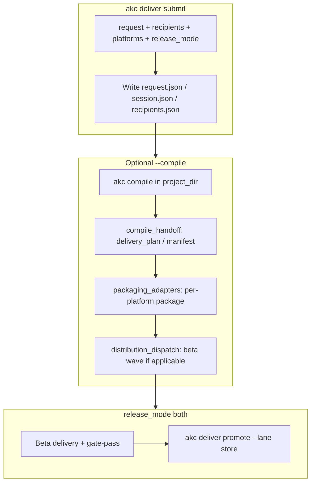

# Delivery — architecture implementation

This document describes how **named-recipient delivery** is implemented in the Agentic Knowledge Compiler: CLI surface, on-disk control-plane artifacts, code layout, and how delivery sits **above** `akc compile` (packaging and distribution consume compile-time `delivery_plan` / manifest refs, not the core compile controller loop).

## Goals (summary)

- Capture a plain-language **request**, explicit **recipients** (never inferred only from free text), **platforms** (`web`, `ios`, `android`), and **release mode** (`beta`, `store`, `both`).
- Optionally run **`akc compile`**, bind compile outputs to the session, run **packaging**, then **distribution** adapters (beta wave first when `release_mode=both`; store promotion after operator gate + `promote`).
- Persist a versioned **delivery request** and **session** under `.akc/delivery/<delivery_id>/`, with events, recipient rows, provider state, and activation evidence.
- Fail closed on missing provider prerequisites per lane; partial per-platform failure is visible in session state.

## CLI commands (from the v1 plan)

The plan defines these public workflows. Paths and placeholders are illustrative — use the `delivery_id` printed by the submit command in your project.

**Submit** — create a delivery session from a request and explicit recipients:

```bash
akc deliver \
  --request "build an app and send it to these 3 users" \
  --recipient alice@example.com \
  --recipient bob@example.com \
  --recipient carol@example.com \
  --platforms web,ios,android \
  --release-mode both
```

**Status** — load request, session, and computed metrics:

```bash
akc deliver status --delivery-id <delivery_id>
```

**Events** — list control-plane timeline entries:

```bash
akc deliver events --delivery-id <delivery_id>
```

**Resend** — record a resend for one recipient (adapters consume this later):

```bash
akc deliver resend --delivery-id <delivery_id> --recipient alice@example.com
```

**Promote** — request promotion to a lane (e.g. store after beta readiness):

```bash
akc deliver promote --delivery-id <delivery_id> --lane store
```

## CLI — implementation flags and subcommands

Implementation extends the plan with project scoping, compile/packaging orchestration, structured recipient files, evidence ingestion, and human gate recording.

**Global / submit (default action when no subcommand is given)**

| Flag                 | Purpose                                                                                                                             |
| -------------------- | ----------------------------------------------------------------------------------------------------------------------------------- |
| `--project-dir`      | Project root containing `.akc/` (default: current directory)                                                                        |
| `--request`          | Plain-language delivery goal (required for submit)                                                                                  |
| `--recipient`        | Repeat per email; **authoritative** list (not parsed from `--request`)                                                              |
| `--recipients-file`  | JSON `{"recipients": [...]}` / `{"emails": [...]}` or one email per line; merged with `--recipient`                                 |
| `--platforms`        | Comma-separated: `web`, `ios`, `android` (default: `web,ios,android`)                                                               |
| `--release-mode`     | `beta` \| `store` \| `both` (default: `beta`)                                                                                       |
| `--delivery-version` | Logical version for the session; drives provider build metadata (default: `1.0.0`)                                                  |
| `--compile`          | Run `akc compile` in the project, bind delivery_plan/manifest refs, then **packaging** (and beta distribution wave when applicable) |

**Additional subcommands**

```bash
# Record human readiness (required before store promotion when release_mode is both)
akc deliver gate-pass --delivery-id <delivery_id> [--note "optional audit note"]

# Ingest activation JSON from the app client (stdin or file)
akc deliver activation-report --delivery-id <delivery_id> [--json-file path/to/payload.json]

# Record provider proof for web beta: signed invite open (HMAC from invite URL)
akc deliver web-invite-open \
  --delivery-id <delivery_id> \
  --invite-token-id <token> \
  --signature <hex_akc_sig>
```

Subcommands that accept it: `--project-dir` on `status`, `events`, `resend`, `promote`, `gate-pass`, `activation-report`, `web-invite-open`.

**Exit codes** — submit with `--compile` returns non-zero if compile fails or packaging reports failure; `promote --lane store` returns non-zero if distribution dispatch reports failure.

## Optional dependencies

Provider HTTP and signing (e.g. App Store Connect JWT, Google auth) are gated behind the **`delivery-providers`** extra in `pyproject.toml`:

```bash
uv sync --extra delivery-providers
```

## On-disk layout (per delivery)

Under `delivery_store.delivery_paths`, each session has:

| File                                                   | Role                                                                                                                                           |
| ------------------------------------------------------ | ---------------------------------------------------------------------------------------------------------------------------------------------- |
| `.akc/delivery/<delivery_id>/request.json`             | Schema-enveloped **delivery request** (v1): request text, platforms, recipients, release mode, parsed block, preflight / required human inputs |
| `.akc/delivery/<delivery_id>/session.json`             | **Session** state: pipeline stages (compile, build, package), per-platform channels, `compile_run_id`, `delivery_version`, phase               |
| `.akc/delivery/<delivery_id>/recipients.json`          | Per-recipient rows (emails, tokens, status)                                                                                                    |
| `.akc/delivery/<delivery_id>/events.json`              | Append-only **event** log (types in `event_types.py`)                                                                                          |
| `.akc/delivery/<delivery_id>/provider_state.json`      | Adapter/provider bookkeeping                                                                                                                   |
| `.akc/delivery/<delivery_id>/activation_evidence.json` | App-side activation / heartbeat evidence                                                                                                       |

`delivery_id` must match a safe path token (no `..`, `/`, or `\`); see `assert_safe_delivery_id`.

## Code layout (`src/akc/delivery/`)

| Module                                           | Responsibility                                                                                                                                                                 |
| ------------------------------------------------ | ------------------------------------------------------------------------------------------------------------------------------------------------------------------------------ |
| `store.py`                                       | Filesystem persistence, validation, session updates, recipient normalization, promotion/resend/gate/activation records                                                         |
| `orchestrate.py`                                 | `run_delivery_compile` (invokes compile CLI), `run_delivery_build_and_package`, ties packaging to compile handoff, triggers post-package beta distribution                     |
| `compile_handoff.py`                             | Load compile outputs: `delivery_plan` ref, manifest presence, web hints for invites                                                                                            |
| `packaging_adapter.py` / `packaging_adapters.py` | Packaging adapter interface and lanes (web / iOS / Android)                                                                                                                    |
| `adapter.py` / `adapters.py`                     | Distribution adapter registry, release lanes per mode                                                                                                                          |
| `distribution_dispatch.py`                       | Run distribution after packaging (web signed invites, TestFlight, Firebase App Distribution, Play, store lanes); `lanes_for_post_package_wave` enforces beta-first when `both` |
| `provider_clients.py`                            | Optional provider API clients (credentials from env / local operator config)                                                                                                   |
| `invites.py`                                     | Invite token IDs and HMAC verification for web invite URLs                                                                                                                     |
| `activation.py` / `activation_contract.py`       | Recipient activation recompute; client contract material for generated apps                                                                                                    |
| `ingest.py`                                      | Recipient file parsing, operator prereqs manifest loading                                                                                                                      |
| `control_index.py`                               | Control-plane audit hooks / session sync with project index                                                                                                                    |
| `metrics.py`                                     | Derived metrics for `akc deliver status`                                                                                                                                       |
| `versioning.py`                                  | Deterministic mapping from logical `delivery_version` to provider build numbers                                                                                                |
| `types.py`                                       | Shared typed helpers (`PlatformBuildSpec`, release enums)                                                                                                                      |
| `event_types.py`                                 | Canonical event type strings (`delivery.request.accepted`, `delivery.build.packaged`, `delivery.invite.sent`, …)                                                               |

CLI wiring: `src/akc/cli/deliver.py` registers parsers and handlers; entry point remains `akc = akc.cli:main` in `pyproject.toml`.

## End-to-end flow



- **Session creation** always runs preflight and may mark the session **blocked** if required lanes lack prerequisites (fail closed).
- For **`both`**, post-package automation runs **`beta`** lanes only; **`akc deliver promote --lane store`** (after **`gate-pass`**) drives the store lane and calls `run_delivery_distribution` with `lanes=("store",)`.

## Event types (control plane)

Implementation uses the strings declared in `event_types.py`, including:

- `delivery.request.accepted`, `delivery.request.parsed`, `delivery.preflight.completed`
- `delivery.compile.completed`, `delivery.compile.outputs.bound`
- `delivery.build.packaged`
- `delivery.invite.sent`, `delivery.invite.resend_requested`
- `delivery.provider.install_detected`, `delivery.activation.first_run`, `delivery.recipient.active`
- `delivery.store.submitted`, `delivery.store.live`, `delivery.store.promotion_requested`
- `delivery.human_gate.passed`, `delivery.failed`

## Tests

- Unit: `tests/unit/test_delivery_packaging_pipeline.py` and related delivery store/preflight tests.
- Integration: `tests/integration/test_delivery_distribution_and_gate.py` (distribution + gate sequencing).

## Related docs

- [architecture.md](architecture.md) — package layout and delivery’s place in the AKC pipeline.
- [artifact-contracts.md](artifact-contracts.md) — schema envelopes for emitted JSON artifacts.
